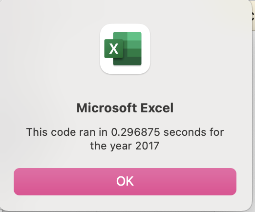

# All Stocks Analysis - VBA Refactoring 

## Overview of Project 
Steve is looking to help his parents sort through green energy stocks to find the best stocks to invest in. They have invested all of their money in DAQO New Energy Corp (stock ticker DQ). Steve wants to analyze 12 green energy stocks (including DQ). Information on the 12 green stocks are located in the "2017" and "2018" tabs of the [VBA_Challenge](VBA_Challenge.xlsm) Excel workbook. Steve sought out help to analyze the data in the workbook utilizing VBA code. 

An initial VBA code was created to find the Total Daily Volume and Return for DQ in 2018, as well as each of the 12 stocks for both 2017 and 2018. Please see the "DQ Analysis" tab and the "All Stocks Analysis" tab in [green_stocks](green_stocks.xlsm) to review these codes. 

Now, Steve would like to do a little more research for his parents and wants to expand the dataset to include the entire stock market over the last few years. 

To ensure that the code will work for thousands of stocks in a timely manner, the purpose of this analysis is to refactor the original code so that the code runs faster while still collecting the same information.

## Refactoring Proccess and Results 

### Refactoring Process
The code was refactored in VBA Module 2 of the [VBA_Challenge](VBA_Challenge.xlsm). Module 1 in the workbook contains the original code. Please see the [VBA_Challenge](VBA_Challenge.xlsm) workbook for access to the codes as well as further descriptions of the steps I took in each part of the refactoring process. 

From the original code, I kept a few steps, which include creating variables and initializing the timer,the `yearValue` input box code, formatting the All Stocks Analysis worksheet, creating headers, initializing the array of all tickers, activating the data worksheet,getting the number of rows to loop over, and formatting the All Stocks Analysis worksheet. 

The area that was refactored in the code was the process to find total volume and returns for each ticker. Below is a description of what was refactored. Please note the codes below are not indented as this is a description only - please see the code within the worksheet for the actual code (which is indented appropriately). 

To refactor the code, I created a variable called "tickerIndex" and set it equal to zero before looping through the data set. This variable will be used to access the stock ticker indexes. 
`tickerIndex = 0`

I then created three output arrays as shown below. I put 11 parantheses after the array name to represent the number of elements in the array (11 since there are 12 tickers). 
    
    `Dim tickerVolumes(11) As Long`
    
    `Dim tickerStartingPrices(11) As Single`
    
    `Dim tickerEndingPrices(11) As Single`

`tickerVolumes` will output the total volumes of each ticker. The data type is set to long as it is a postive whole number, and tends to be fairly large. 

`tickerStartingPrices` will output the tickers' starting price, which will be used to calculate the tickers' return. The data type is set to single as it will be a number that has a decimal place. 

`tickerEndingPrices` will output the ticerks' ending price, which will be used to calculate the tickers' return. The data type is set to single as it will be a number that has a decimal place. 

I then created a For Loop to initialize the tickerVolumes to zero.

`For i = 0 To 11`
    
    `tickerVolumes(i) = 0`

`Next i`

Next, I created a For Loop to loop over all the rows in the spreadsheet. Within the For Loop, I created code by using the tickerIndex to access the stock ticker index for the tickers array and all three output arrays (totalVolumes, tickerStartingPrices and tickerEndingPrices).

To get the total volume for each ticker within the For Loop, I utilized the code below, where the `tickerIndex` is used to access the stock ticker indexes. 

`tickerVolumes(tickerIndex) = tickerVolumes(tickerIndex) + Cells(i, 8).Value`

To get the starting price for each ticker within the For Loop, I used an If statement to check if the current row is the first row for the ticker.

If the ticker in the current row is different than the ticker in the row before it...

`If Cells(i, 1).Value = tickers(tickerIndex) And Cells(i - 1, 1).Value <> tickers(tickerIndex) Then`

Then the current row contains the starting price, and the tickerStartingPrices for the ticker should be set to the value in column 6 of the current row. 

  `tickerStartingPrices(tickerIndex) = Cells(i, 6).Value`

`End if`

To get the ending price for each ticker within the For Loop, I used another if statement to check if the current row is the last row for that ticker.

If the ticker in the current row is different than the ticker in the row after it... 

`If Cells(i, 1).Value = tickers(tickerIndex) And Cells(i + 1, 1).Value <> tickers(tickerIndex) Then`

Then the current row contains the ending price, and the tickerEndingPrices for the ticker should be set to the value in column 6 of the current row. 

  `tickerEndingPrices(tickerIndex) = Cells(i, 6).Value`

`End If`

Lastly, within the For Loop, I utilized another If statement to increase the tickerIndex by one, once the calculations for the current ticker is complete. 

If the ticker in the current row is different than the ticker in the next row....

`if Cells(i, 1).Value = tickers(tickerIndex) And Cells(i + 1, 1).Value <> tickers(tickerIndex)` 

Then increase the tickerIndex by 1
  
  `tickerIndex = tickerIndex + 1`

`End If`

I then ended the For Loop. 
`Next i` 

I then created a For Loop to loop through the arrays to output the Ticker, Total Daily Volume, and Return in the All Stocks Analysis Worksheet. 

The for loop is set from 0 to 11 to account for the different indexes in the four arrays, where i represents the index in the array (and ultimately represents the index associated with the 12 tickers)

`For i = 0 To 11`
        
I then activated the worksheet where we want to input our data

`Worksheets("All Stocks Analysis").Activate`
        
Next I indicated that for each index in the four arrays, place the ticker, total volume, and Return values in specific cells associated with that index in the All Stocks Analysis worksheet.

Displays the ticker name under the ticker header

`Cells(4 + i, 1).Value = tickers(i)`

Displays the total daily volume for each ticker

`Cells(4 + i, 2).Value = tickerVolumes(i)`

Calculates return for each ticker by dividing the tickers' ending price by the tickers' starting price and subtracting by 1. This ultimately gets the percentage change of the ticker's price. 

`Cells(4 + i, 3).Value = tickerEndingPrices(i) / tickerStartingPrices(i) - 1`
        
Then I closed the For Loop    

`Next i`

After this, I kept the formatting of the All Stocks Analysis from the original code and also ended the timer. 

I created a buttons for both the refactored code and original code in the All Stocks Analysis sheet so that Steve can easily use both codes and compare the efficiency of each. 

### Results 
Below is a description of the results of the analysis. I compare the stock performance between 2017 and 2018, as well as the execution times of the original script and the refactored script.

#### Comparing Stock Performance between 2017 and 2018
When running the VBA code, the ticker, volume and return for each stock is outputted into the All Stocks Analysis sheet. The output is dependent on the year the user inputs in the input box that shows up once they initiate the code (they can input either 2017 or 2018). 

For 2017, it appears that all stocks performed fairly well with the exception of "TERP" which had the lowest return (-7.2% return and 139,402,800 in total daily volume). "DQ", the stock that Steve's parents are fully invested in actually performed the highest (199.4% return and had the lowest total daily volume of 35,796,200). Steve's parents believe that if a stock is traded often, then the price will accurately reflect the value of the stock. Since DQ's total daily volume is comparatively the lowest, based on their belief, the prices of the stock utilized to calculate return may not be as accurate as other stocks. Second best was "SEDG" which returned 184.5% and had a totaly daily volume of 206,885,200. The total daily volume for this stock is comparatively high compared to other stocks for 2017 - and based on Steve's parents belief about total volume, should accurately reflect the return for that stock.

The resulting output for 2017 is shown below. 

For 2018, it appears that most stocks did not perform well, with the exception of "ENPH" and "RUN". "ENPH" had a positive return of 81.9% with a total daily volume of 607,473,500. "RUN" had a positive return of 84.0% with a total daily volume of 502,757,100. The returns are a lot higher than all other stocks that had negative returns. For 2018, "DQ" actually performed the worst with a return of -62.6%, it also had a total daily volume of 107,873,900 (comparatively lower than other stocks). Second worst performance was by "JKS" which had a return of -60.5% and had total daily volume of 158,309,000. 

The resulting output for 2018 is shown below. 

Based on the above, Steve should recommend his parents look into diversifying their portfolio by investing in "ENPH". The stock had the third highest returns in 2017, and also performed the best in 2018 while most other stocks had negative returns. The stock also had a fairly high total daily volume in both years, which implicates that the prices for the stock are accurately reflected. 

In looking at "DQ", it apepars that the stock may be the riskiest. While it had the highest return in 2017, it had the lowest return in 2018. It also had comparatively low total daily volume in both years, which may implicate that the stock prices are not accurately reflected. As a result, Steve may want to recommend lowering their investment amount in the stock or selling their stock, depending on their risk profile. 

#### Comparing Execution Times 
In comparing the refactored code to the original code, it appears that the refactored code is more efficient and ran faster that the original code. 

For 2017, below is the execution time for the refactored code. 

For 2017, below is the execution time for the original code. 

For 2018, below is the execution time for the refactored code. 

For 2018, below is the execution time for the original code.

For both 2017 and 2018, the refactored code had an execution time of 0.085937 seconds, while the old code had an exection time of 0.296875 seconds. The refactored code is about 71% faster than the old code and will make Steve's future analysis more efficient. This will be helpful when he expands the dataset to include the entire stock market (won't take as long to execute as the old code). 

The efficiency of the refactored code derives from utilizing the tickerIndex to access the stock ticker index for each output array. This allows the code to loop through the data once. As opposed to the original code where there was a nesting loop, and the code had to loop through the data multiple times in order to calculate the output. 

## Summary 

### Advantages and Disadvantages of Refactoring Code 
The advantages of refactoring code is that when an initial code is created, it may not always be the best approach to get the output needed. Refactoring code allows us to look back at the original code and make changes to part of the code, to make the code: 

* Identifying Code Smells: refactoring can help identify where the code works and solves the problem it's supposed to, but something about the code indicates that there is probably a more elegant and productive solution to the problem. Specifically, it can identify anit-patterns(when code is ineffective, too specialized, or generally counterproductive) as well as kludges (quick and dirty turnarounds) 

* More flexibility: if there needs to be a change in the dataset, ensures the code will still run and provide the same output 

* More efficiency: when the code is initially created, it may not be the best or fastest way to get the needed output 

* Helps to find bugs: When looking back at the code, it can help identify bugs (or potential for future bugs if data is changed).

* Clean up the Code: refactoring provides an opportunity to clean up the code to make it more readable and understandable

The disadvantages of refactoring code include: 
* It can be time consuming to look through the code, and may be difficult to understand if there are no comments/descriptions to show the purpose of the code 

* In the process of refactoring code, bugs can be created where the intended output is no longer provided. This can create inefficiency.

### Pros and Cons of the All Stocks Analysis Refactored and Original VBA Code 
The pros of the of the All Stocks Analysis refactored code include:
* more flexible: in this case, Steve wants to add more stocks into the dataset. The code was refactored to ensure when he adds more stocks to the dataset, the code will still run. While the original code also did this, it may not be the most efficient way (and would take a long time)

* more efficient: in this case, the refactored code ran a lot faster (71% faster than the original code), and will run a lot faster than the original code when he adds more data in. 

* the code is a lot cleaner (not as many steps in the code)

The cons of the All Stocks Analysis refactored code include: 
* It may not be as easy for someone to understand. The original code was a more intuitive way to approach the code (although not as efficient). For someone who reviews the code who may not have a lot of experience with VBA script, it may not be as inutitive to create a tickerIndex and utilize it to access the output arrays. However, with detailed mapping and descriptions of the code at every step, this should help explain what the code is doing. 

* When Steve wants to add more tickers, he will still need to initialize the array of all tickers (by assigning the new tickers an index). Unfortunately there is no shortcut for this step. 

In line with what it is stated above: 

The pros to the original All Stocks Analysis code includes: 
* easier to understand for someone who is not as experienced with VBA script. The original code was more inutitive (but not as efficient)

The cons of the original All stocks Analysis code includes: 
* not as fast 
* not as flexible 
* not as clean (extra steps that aren't necessary - such as nesting loops)

